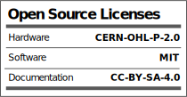

Picture courtesy of Wackalope#6737

  

- [EyeTrackVR](#eyetrackvr)
      - [This project is in development and is not fully finished](#this-project-is-in-development-and-is-not-fully-finished)
  - [Hardware](#hardware)
  - [About IR Emitter Safety](#about-ir-emitter-safety)
        - [Make sure you are using NON-focused emitters and at around 5ma total power](#make-sure-you-are-using-non-focused-emmiters-and-at-around-5ma-total-power)
  - [Firmware](#firmware)
  - [Headset support](#headset-support)
      - [Contact](#contact)
- [Licenses](#licenses)

### [Documentation](https://redhawk989.github.io/EyeTrackVR/)

# EyeTrackVR

Open source and *affordable* VR eye tracker platform for [VRChat](https://hello.vrchat.com/) via `OSC` and `UDP` protocol.

> **Note**: This project is in development and is not fully finished

## Documentation
Please check out our [documentation site.](https://redhawk989.github.io/EyeTrackVR/)

## Hardware

3d files for mounting brackets will be found [here](https://github.com/RedHawk989/EyeTrackVR-Hardware)
IR emitter files are also located there. For more info please reference our [documentation site](https://redhawk989.github.io/EyeTrackVR/parts-list/)

## ESP-CAM Firmware

Current work has been with our official firmware by `lorow`, found [here](https://github.com/lorow/OpenIris).

## Headset support

Any headset that can fit the camera and LEDs can likely be supported, however, mounts may not have been made for it. Please reference to our [parts list](https://redhawk989.github.io/EyeTrackVR/parts-list/#other-parts) for details.

## About IR Emitter Safety

Please *exercise extreme caution* when messing around with IR emitters.
<ins>Once safety testing has been completed links and files will be provided for the emitters</ins>. Please make sure you know what you are doing when assembling the IR emitters.
 <ins>**DO NOT BYPASS (OR NOT DO) ANY SAFETY FEATURES PUT IN PLACE**</ins>. This can result in irreversible bodily harm.
The safety measures were put in place to REDUCE the potential failure risk. All further safety responsibilities are on the user.
This includes visually checking with an IR camera that the brightness is correct and making sure you do not feel warmth.

> **Warning**: Make sure you are using **NON-focused** emitters and at around ***5ma-8ma total power per eye***.

[Effect of infrared radiation on the lens](https://github.com/RedHawk989/EyeTrackVR/blob/docs/docs/Reference_Docs/saftey/effect_of_ir_on_the_lens.pdf)

[Training-library Nir Stds](https://github.com/RedHawk989/EyeTrackVR/blob/docs/docs/Reference_Docs/saftey/training-library_nir_stds_20021011.pdf)

[AN002_Details on photobiological safety of LED light sources](https://github.com/RedHawk989/EyeTrackVR/blob/docs/docs/Reference_Docs/saftey/AN002_Details_on_photobiological_safety_of_LED_light_sources.pdf)

## Contact

Please join our Discord for updates and any questions.

## Licenses

***All software is under the [MIT License](http://opensource.org/licenses/MIT).
All documentation, including the [Wiki](https://github.com/RedHawk989/EyeTrackVR/wiki), is under the Creative Commons CC-BY-SA-4.0 license***.

<!-- 

 -->

[Top](#eyetrackvr)
